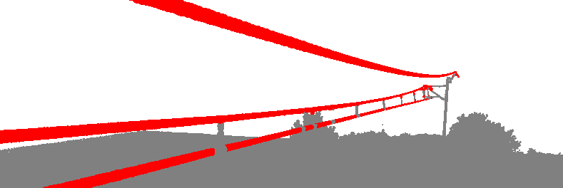
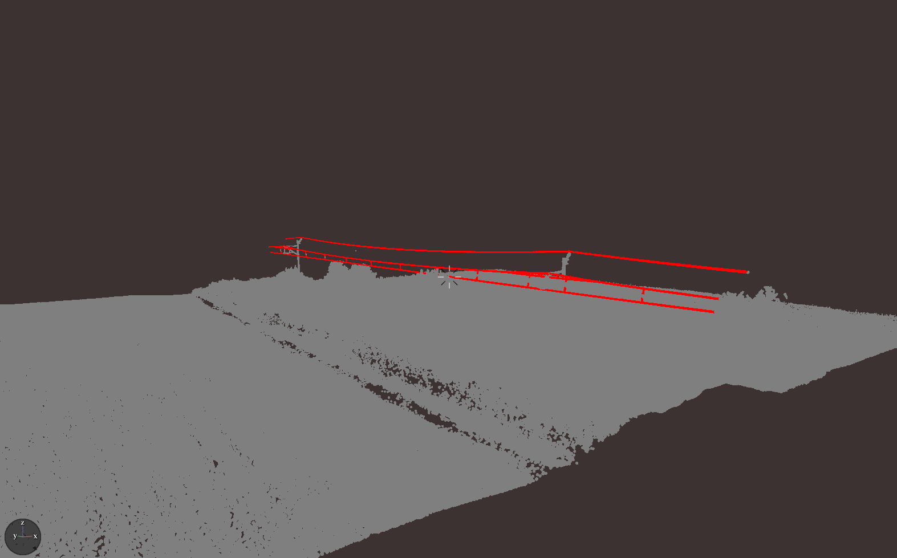
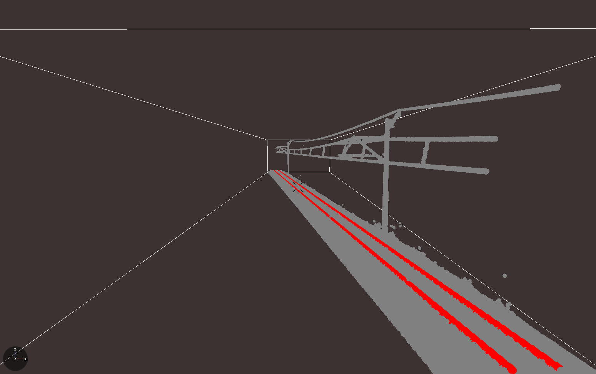
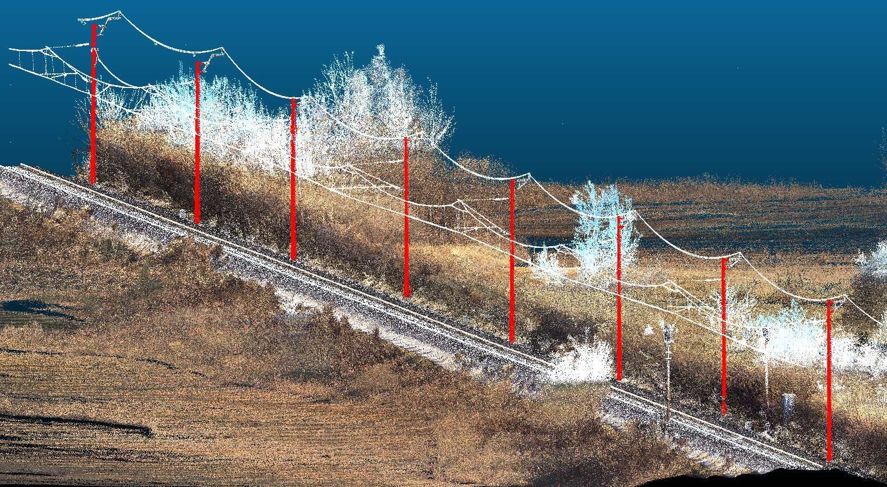
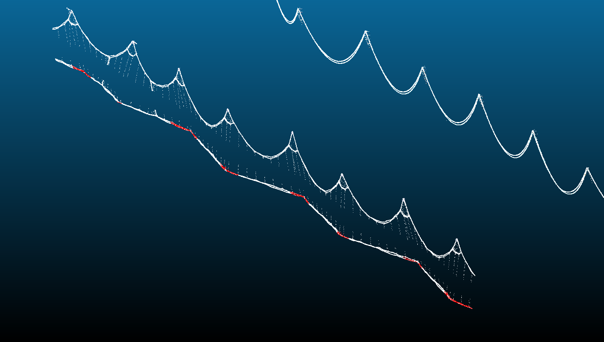
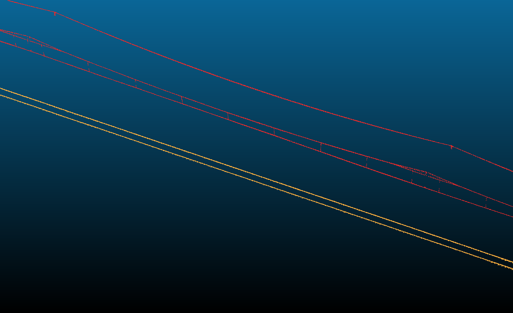

Robust Railroad Infrastructure Detection Framework
=========================================

This software library and tool provides a fast and robust solution to extract various railroad infrastructure from dense (MLS) LiDAR point clouds. Primary focus is given to cable and railtrack detection.

Contents
------------
 * [Build instructions](BUILD.md)
 * [Usage instructions](USAGE.md)

Sample results
------------
*Above* pipeline result:  

*HeightGrowth* pipeline result:  

*RailTrack* pipeline result:  

*PoleDetection* pipeline result:  

*CableStaggerCheckingFirstClass* pipeline result:  

Combined cable and rail detection result:  

Publications
------------
 * Máté Cserép, Péter Hudoba, Zoltán Vincellér: *Robust Railroad Cable Detection in Rural Areas from MLS Point Clouds*, In Proceedings of Free and Open Source Software for Geospatial (FOSS4G) Conference, Vol. 18 , Article 2, 2018, [DOI: 10.7275/z46z-xh51](https://doi.org/10.7275/z46z-xh51)
 * Friderika Mayer: *Powerline tracking and extraction from dense LiDAR point clouds*, MSc thesis, Eötvös Loránd University, 2020, [PDF](https://gis.inf.elte.hu/wordpress/wp-content/uploads/2020/07/mayer_friderika_msc_compressed.pdf)
 * Adalbert Demján: *Object extraction of rail track from VLS LiDAR data*, MSc thesis, Eötvös Loránd University, 2020, [PDF](https://gis.inf.elte.hu/wordpress/wp-content/uploads/2020/07/demjan_adalbert_msc_compressed.pdf)
 * **Máté Cserép, Adalbert Demján, Friderika Mayer, Tábori Balázs, Péter Hudoba: *Effective Railroad Fragmentation And Infrastructure Recognition Based On Dense LiDAR Point Clouds*, ISPRS Ann. Photogramm. Remote Sens. Spatial Inf. Sci., V-2-2022, pp. 103–109, 2022, [DOI: 10.5194/isprs-annals-V-2-2022-103-2022](https://doi.org/10.5194/isprs-annals-V-2-2022-103-2022)**
 * Dénes Ertl: *Automatic rail tie recognition and error detection using LiDAR point clouds*, MSc thesis, Eötvös Loránd University, 2023, [PDF](https://gis.inf.elte.hu/wordpress/wp-content/uploads/2023/07/ertl_denes_msc_compressed.pdf)
 * Attila Láber: *Catenary segmentation and error detection in LiDAR point clouds*, MSc thesis, Eötvös Loránd University, 2023, [PDF](https://gis.inf.elte.hu/wordpress/wp-content/uploads/2023/07/laber_attila_msc_compressed.pdf)

Contributing
------------

Please read [CONTRIBUTING.md](CONTRIBUTING.md) for details on coding conventions.

License
------------

This project is licensed under the BSD 3-Clause License - see the [LICENSE](LICENSE) file for details.
